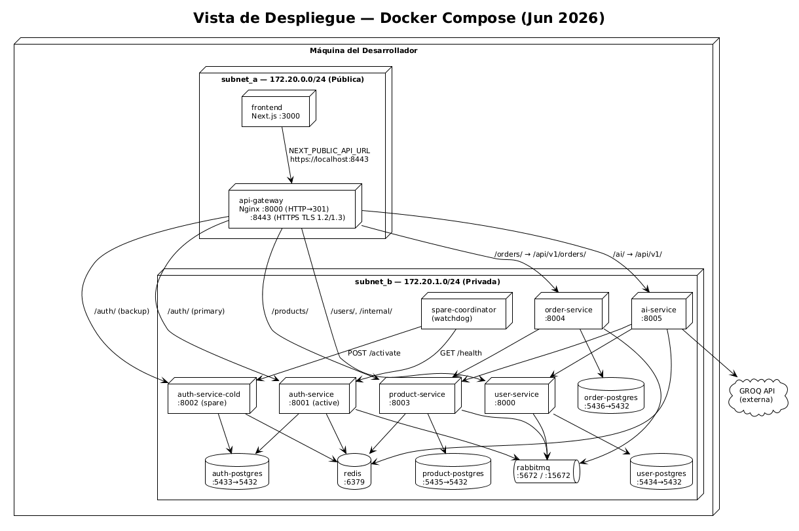
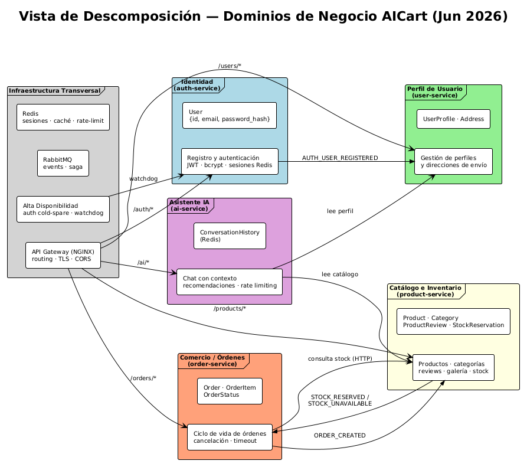
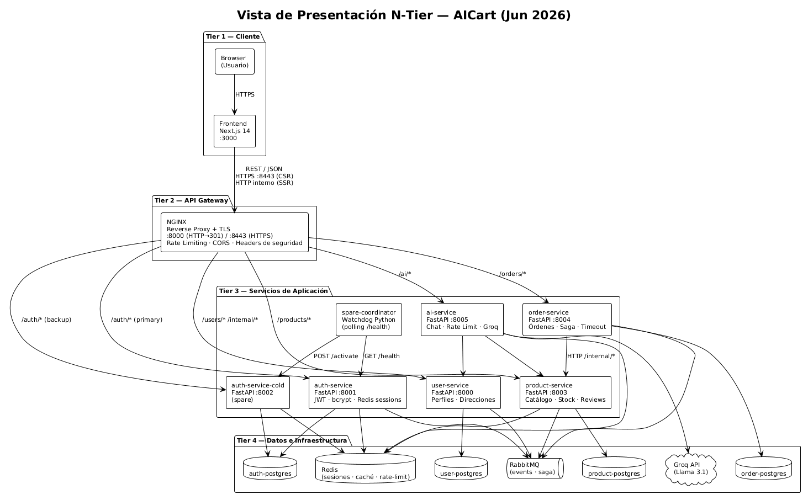

# AICart — Plataforma de E-Commerce con IA

**Curso:** Software Architecture 2026-I  
**Stack:** Next.js 14 · FastAPI · NGINX · RabbitMQ · Redis · PostgreSQL · Groq LLM  
**Licencia:** MIT

---

## ¿Qué es AICart?

AICart es una plataforma de e-commerce de microservicios con un asistente de IA integrado. Permite a compradores explorar un catálogo de productos, crear órdenes y recibir recomendaciones personalizadas del chat AI; y a vendedores gestionar sus productos y ver sus ventas.

El proyecto aplica patrones reales de arquitectura de software: segmentación de red, saga pattern, cold-spare failover, TLS/HTTPS, rate limiting de doble capa e idempotencia en eventos distribuidos.

---

## Características principales

- Autenticación con JWT, sesiones en Redis y logout con blacklist
- Catálogo de productos con categorías, galería de imágenes y reviews
- Flujo de órdenes con confirmación de stock vía **Saga Pattern** (coreografía RabbitMQ)
- Chat AI con memoria conversacional (Groq + Llama 3.1) limitado al inventario real
- Failover automático del auth-service con réplica **cold-spare** y watchdog
- Rate limiting de doble capa (NGINX + Redis sliding window) en el endpoint AI
- HTTPS end-to-end con TLS 1.2/1.3 y redirección forzada desde HTTP
- Segmentación de red en dos subredes Docker (pública / privada)

---

## Stack tecnológico

| Capa | Tecnología |
|---|---|
| Frontend | Next.js 14 (App Router, SSR + CSR) |
| Backend | FastAPI, Python 3.12 (3.11 en user-service) |
| API Gateway | NGINX 1.27 (reverse proxy + TLS + rate limiting) |
| Mensajería | RabbitMQ 3 (topic exchange + DLQ) |
| Caché / sesiones | Redis 7 |
| Bases de datos | PostgreSQL 16 × 4 instancias (DB-per-service) |
| AI / LLM | Groq API (Llama 3.1 8b Instant) |
| Contenedores | Docker Compose |
| Failover | Python watchdog (coordinator) |

---

## Requisitos previos

- Docker y Docker Compose
- `mkcert` (recomendado) u `openssl` para el certificado TLS
- ~4 GB de RAM disponibles
- Puertos libres: `3000`, `8000`, `8443`, `5432–5436`, `6379`, `5672`, `15672`
- API Key de Groq (obtener en [console.groq.com](https://console.groq.com))

---

## Cómo ejecutar

```bash
# 1. Clonar el repositorio
git clone <repo-url>
cd ecommerce-project

# 2. Configurar variables de entorno
cp .env.example .env
# Editar .env y establecer: AI_API_KEY=<tu-clave-groq>

# 3. Generar certificado TLS (solo la primera vez)
bash generate_certs.sh

# 4. Levantar el stack
docker compose up -d --build

# 5. Verificar que todos los servicios estén healthy
docker compose ps

# 6. Confiar el certificado (solo la primera vez por navegador)
#    Abrir: https://localhost:8443/health
#    → "Avanzado" → "Continuar a localhost"

# 7. Abrir la aplicación
#    http://localhost:3000
```

> El certificado es autofirmado. El paso 6 es necesario para que el frontend pueda
> comunicarse con el gateway por HTTPS sin bloqueos del browser.

### Puntos de acceso

| Servicio | URL |
|---|---|
| Frontend | http://localhost:3000 |
| API Gateway HTTPS | https://localhost:8443 |
| API Gateway HTTP (redirige) | http://localhost:8000 |
| RabbitMQ Management UI | http://localhost:15672 (guest/guest) |

### Reset de datos

```bash
docker compose down -v   # elimina los 4 volúmenes Postgres + RabbitMQ
```

---

## Variables de entorno

Las variables críticas que deben configurarse en `.env`:

| Variable | Descripción |
|---|---|
| `AI_API_KEY` | API Key de Groq (requerida para el chat AI) |
| `AUTH_JWT_SECRET` | Secret para firmar JWT (mín. 32 chars) |
| `RABBITMQ_USER` / `RABBITMQ_PASS` | Credenciales de RabbitMQ |

> La fuente operativa completa son los `environment:` de cada servicio en `docker-compose.yml`.
> Los valores por defecto ahí son suficientes para levantar el stack en desarrollo.

---

## Arquitectura

### Segmentación de red

El sistema usa dos subredes Docker aisladas. **El API Gateway es el único contenedor conectado a ambas redes**, actuando como el único punto de entrada al backend.

```
Internet / Browser
      │
      ▼
┌─────────────────────────── subnet_a (172.20.0.0/24) ──────────────────────────┐
│  frontend :3000         api-gateway :8000 (HTTP→301) / :8443 (HTTPS)          │
└────────────────────────────────────┬──────────────────────────────────────────┘
                                     │
┌────────────────────────── subnet_b (172.20.1.0/24) ───────────────────────────┐
│  auth-service :8001      user-service :8000     product-service :8003         │
│  auth-service-cold :8002  order-service :8004   ai-service :8005              │
│  spare-coordinator       4× PostgreSQL           RabbitMQ    Redis            │
└───────────────────────────────────────────────────────────────────────────────┘
```

### Diagramas de arquitectura

**Componentes y Conectores** — qué habla con qué y por qué canal:


**Despliegue** — cómo se mapean los contenedores y las redes:



**Descomposición** — organización interna del código por paquete:



**Presentación** — estructura del frontend Next.js:



> Los fuentes PlantUML se encuentran en `docs/architecture/*.puml`.

---

## Patrones arquitectónicos implementados

### 1. Network Segmentation Pattern

Particiona la red Docker en dos zonas para limitar el alcance de un posible ataque. La zona pública (`subnet_a`) solo expone frontend y gateway; la zona privada (`subnet_b`) aloja toda la lógica y los datos.

```yaml
# docker-compose.yml
networks:
  subnet_a:
    ipam:
      config:
        - subnet: 172.20.0.0/24   # pública
  subnet_b:
    ipam:
      config:
        - subnet: 172.20.1.0/24   # privada
```

**Beneficio:** Un atacante que comprometa el frontend no puede alcanzar directamente las bases de datos ni los servicios internos.

---

### 2. Reverse Proxy Pattern

NGINX actúa como punto único de entrada. Los clientes nunca conocen la topología interna ni los puertos reales de los microservicios.

```nginx
# api-gateway/shared.conf
location /orders/ {
    rewrite ^/orders/(.*) /api/v1/orders/$1 break;
    proxy_pass http://order-service:8004;
}

location /ai/ {
    rewrite ^/ai/(.*) /api/v1/$1 break;
    proxy_pass http://ai-service:8005;
    proxy_read_timeout 60s;
    limit_req zone=ai_zone burst=5 nodelay;
}
```

CORS, headers de seguridad (`X-Frame-Options`, `X-Content-Type-Options`, HSTS) y SSL Termination se gestionan en un único lugar.

---

### 3. Secure Channel Pattern (TLS/HTTPS)

Todo el tráfico externo viaja cifrado. HTTP queda bloqueado con redirección 301.

```nginx
# api-gateway/nginx.conf
server {
    listen 8000;
    return 301 https://$host:8443$request_uri;
}

server {
    listen 8443 ssl;
    ssl_certificate     /etc/nginx/certs/nginx.crt;
    ssl_certificate_key /etc/nginx/certs/nginx.key;
    ssl_protocols       TLSv1.2 TLSv1.3;
    ssl_ciphers         HIGH:!aNULL:!MD5;
    add_header Strict-Transport-Security "max-age=31536000; includeSubDomains" always;
}
```

---

### 4. Saga Pattern (coreografía)

El flujo de confirmación de stock entre Order Service y Product Service se implementa como una saga coreográfica sobre RabbitMQ. No hay orquestador central — cada servicio reacciona a los eventos del otro.

```
POST /orders/
    │
    ▼ publica ORDER_CREATED
[commerce.saga exchange — topic]
    │
    ▼ ProductSagaConsumer
  lock pesimista sobre stock (with_for_update)
  crea StockReservation
  publica STOCK_RESERVED / STOCK_UNAVAILABLE
    │
    ▼ OrderSagaConsumer
  transiciona orden → confirmed / cancelled
```

La idempotencia se garantiza con la tabla `processed_events` (PK `event_id`) en ambos servicios. Si NGINX entrega el evento dos veces, el segundo intento es ignorado silenciosamente.

```python
# order_service/src/events/consumer.py
existing = db.query(ProcessedEvent).filter_by(event_id=event_id).first()
if existing:
    return   # evento ya procesado
```

**Archivos clave:** `order_service/src/events/`, `product_service/src/events/`, `order_service/src/schemas/events.py::build_envelope`

---

### 5. Cold-Spare Redundancy (auth-service)

El servicio de autenticación tiene una réplica spare (apagada) y un watchdog que la activa automáticamente ante fallos del primario.

```
spare-coordinator  ──(GET /health cada 3s)──▶  auth-service :8001 (active)
        │
        └──(POST /activate, tras 3 fallos)──▶  auth-service-cold :8002 (spare)
```

```nginx
# api-gateway/nginx.conf
upstream auth_backend {
    server ecommerce_auth_service:8001      max_fails=2 fail_timeout=5s;
    server ecommerce_auth_service_cold:8002 backup;
}
```

NGINX detecta el fallo del primario de forma independiente y redirige al backup. El coordinator activa la réplica para que esté lista.

**Archivos clave:** `coordinator/coordinator.py`, `backend/auth_service/main.py` (endpoint `/activate` + variable `CURRENT_ROLE`)

---

### 6. Rate Limiting de doble capa (AI Service)

El AI Service llama a un LLM externo (Groq) con costo por request. Se implementaron dos capas independientes:

**Capa 1 — NGINX (por IP):** 2 req/s con burst de 5, responde 429 antes de llegar al servicio.

```nginx
limit_req_zone $binary_remote_addr zone=ai_zone:10m rate=2r/s;

location /ai/ {
    limit_req zone=ai_zone burst=5 nodelay;
    limit_req_status 429;
}
```

**Capa 2 — Redis Sliding Window (por usuario JWT o IP):** 10 req/60 s. Fail-open si Redis no está disponible (no bloquea el servicio).

```python
# backend/AI_service/src/core/rate_limit.py
# Sorted sets de Redis — ventana deslizante
await redis.zremrangebyscore(key, 0, now - window_seconds)
count = await redis.zcard(key)
if count >= limit:
    raise HTTPException(status_code=429, ...)
```

Headers de respuesta: `X-RateLimit-Limit`, `X-RateLimit-Remaining`, `X-RateLimit-Reset`, `Retry-After` (solo en 429).

---

## Estrategias de diseño

| Estrategia | Descripción | Archivos |
|---|---|---|
| **Database-per-service** | 4 instancias Postgres completamente aisladas. Ningún servicio puede acceder a la BD de otro directamente | `docker-compose.yml` |
| **Event-driven (RabbitMQ)** | Registro de usuarios (AUTH_USER_REGISTERED), saga de stock y eventos de orden viajan por exchanges desacoplados | `*/src/events/` |
| **Idempotencia de eventos** | Tabla `processed_events` con PK `event_id` en order y product service. Previene doble procesamiento en redelivery | `order_service/src/models/`, `product_service/src/models/processed_event.py` |
| **Lock pesimista en stock** | `SELECT ... FOR UPDATE` al reservar stock impide race conditions bajo concurrencia | `product_service/src/events/consumer.py` |
| **Cache Redis cross-service** | Product service cachea nombre de seller (vía user-service) y nombre de categoría con TTL 900 s | `product_service/src/services/product_service.py` |
| **Timeout automático de órdenes** | Worker async cancela órdenes que llevan más de 30 s en `pending_stock_confirmation` | `order_service/src/services/timeout_worker.py` |
| **Fail-open en rate limiter** | Si Redis no responde, el middleware AI permite el request (disponibilidad > protección) | `AI_service/src/core/rate_limit.py` |

---

## Estructura del repositorio

```
ecommerce-project/
├── api-gateway/           NGINX: nginx.conf, shared.conf, certs/
├── backend/
│   ├── AI_service/        Chat AI: Groq, rate limiting, historial Redis
│   ├── auth_service/      Autenticación: JWT, bcrypt, cold-spare endpoint
│   ├── order_service/     Órdenes: saga consumer/publisher, timeout worker
│   ├── product_service/   Catálogo: saga, reservas de stock, galería
│   ├── user-service/      Perfiles: consumer de eventos RabbitMQ
│   └── tests/             Tests de integración (pytest-asyncio)
├── coordinator/           Watchdog Python para failover del auth-service
├── docs/
│   ├── architecture/      4 diagramas PlantUML + PNG (vistas C&C, Deployment, etc.)
│   ├── lab4/              Lab 4: Reverse Proxy Pattern (README + C&C.png)
│   └── lab 5/             Lab 5: Security Patterns + JMeter (README + .jmx + results/)
├── frontend/              Next.js 14: App Router, SSR, ChatWidget, middleware
├── rabbitmq/              rabbitmq.conf
├── generate_certs.sh      Genera TLS con mkcert o openssl
└── docker-compose.yml
```

---

## Testing

Los tests son de integración y requieren el stack levantado. Se ejecutan con `pytest-asyncio` y clientes `httpx` async, uno por servicio.

```bash
cd backend/tests
pip install -r requirements.txt

pytest                              # todos los tests
pytest -m auth                      # por marcador: auth, user, product, order, ai
pytest -m integration               # tests de flujo cross-servicio
pytest test_order_product_integration.py::test_nombre   # test individual
```

> El frontend no tiene suite de tests automatizados.

---

## Labs entregados

### Lab 4 — Reverse Proxy Pattern

Implementación de NGINX como reverse proxy centralizado sobre el sistema de microservicios. Se documentó la vista de Componentes & Conectores del sistema completo con las 5 rutas de servicio, conexiones a bases de datos individuales, RabbitMQ, Redis y la API de Groq.

→ [Documentación detallada del Lab 4](docs/lab4/README.md) · [Diagrama C&C](docs/lab4/C%26C.png)

---

### Lab 5 — Security Patterns + Rate Limiting

Implementación de tres patrones de seguridad (Network Segmentation, Reverse Proxy, Secure Channel/TLS) complementados con rate limiting de doble capa (NGINX + Redis sliding window) sobre el AI Service. Validado con 8 escenarios de pruebas de carga en Apache JMeter — los resultados demuestran que con rate limiting NGINX bloquea ataques en 1–183 ms con 0% de carga al LLM, frente a tiempos de 9–12 s sin protección.

→ [Documentación completa del Lab 5 con tablas JMeter](docs/lab%205/README.md)

---

## Referencias

- [NGINX Rate Limiting](https://nginx.org/en/docs/http/ngx_http_limit_req_module.html)
- [NGINX TLS/SSL Configuration](https://nginx.org/en/docs/http/configuring_https_servers.html)
- [Docker Network Drivers](https://docs.docker.com/network/)
- [RabbitMQ Topic Exchanges](https://www.rabbitmq.com/tutorials/tutorial-five-python)
- [Redis Sorted Sets](https://redis.io/docs/data-types/sorted-sets/)
- [Saga Pattern — Chris Richardson](https://microservices.io/patterns/data/saga.html)
- [Groq API](https://console.groq.com/docs)
- [Apache JMeter](https://jmeter.apache.org/)
