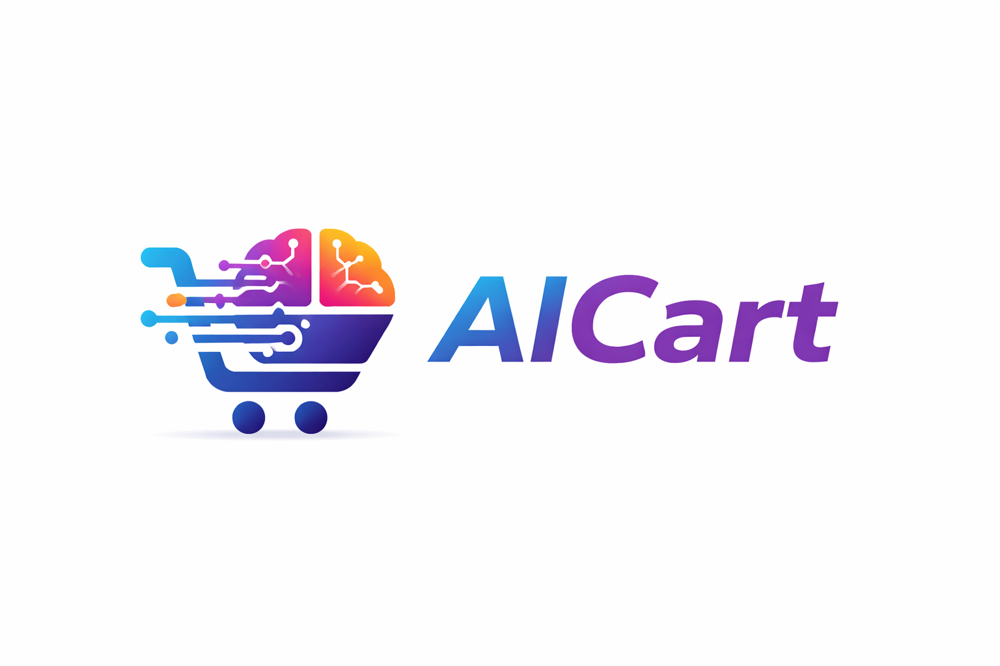
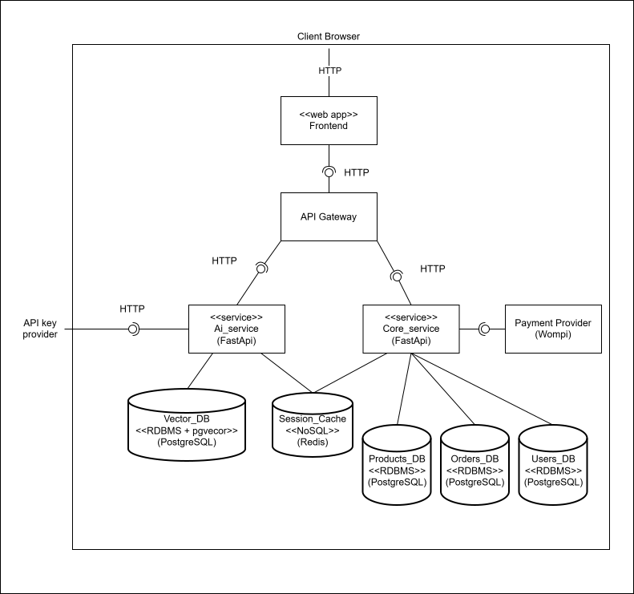

# Primera Entrega — Prototipo Arquitectónico
**Curso:** Arquitectura de Software (Arquisoft)  
> **Entrega:** Primera Entrega — Prototipo Vertical  
> **Fecha:** 2026-03-18

---

## Equipo

**Nombre:** Grupo D

| # | Nombre completo |
|---|---|
| 1 | Sara Isabel Ospina Valderrama |
| 2 | Juan David Castañeda Cárdenas |
| 3 | John Alejandro Pastor Sandoval |
| 4 | Andrés Felipe Perdomo Uruburu |

---

## Sistema de Software

<h1 align="center">AICart</h1>

<p align="center">
  
</p>

<p align="center">
  Plataforma de e-commerce moderna 🚀
</p>

**Descripción:**

Se propone el desarrollo de una plataforma de comercio electrónico tipo B2C (Business-to-Consumer) inteligente, que permite a los usuarios explorar un catálogo de productos multi-categoría, gestionar un carrito de compras y completar transacciones mediante una pasarela de pagos integrada.

La plataforma incorpora capacidades de inteligencia artificial generativa para mejorar la experiencia del usuario, incluyendo búsqueda inteligente de productos, recomendaciones personalizadas basadas en el historial de navegación, compras y tendencias del catálogo, así como un asistente conversacional que facilita la interacción y navegación dentro del sistema.

Adicionalmente, el sistema implementa mecanismos de moderación automatizada de reseñas con el fin de garantizar la calidad y pertinencia del contenido generado por los usuarios.

Para ello, se integra el modelo Google Gemini Flash como proveedor de servicios de IA generativa, permitiendo la incorporación de funcionalidades avanzadas sin requerir el entrenamiento de modelos propios.

---

## Requerimientos Funcionales

Los siguientes requerimientos funcionales definen el dominio y el alcance del sistema:

| ID | Descripción |
|---|---|
| RF-01 | El sistema debe permitir el registro de nuevos usuarios, inicio de sesión y gestión de perfiles individuales. |
| RF-02 | El sistema debe almacenar el historial de compras y las interacciones de los usuarios con los productos, incluyendo acciones como la visualización y la adquisición de productos. |
| RF-03 | El sistema debe permitir a los usuarios visualizar el catálogo completo de productos disponibles en la plataforma. |
| RF-04 | El sistema debe permitir a los usuarios gestionar su carrito de compras, incluyendo agregar productos, eliminar productos y modificar la cantidad de unidades antes de realizar la compra. |
| RF-05 | El sistema debe generar recomendaciones de productos personalizadas utilizando un sistema de inteligencia artificial que analice el historial de compras y las interacciones de los usuarios con los productos. |
| RF-06 | El sistema debe permitir a los usuarios publicar reseñas y calificaciones sobre los productos que hayan adquirido. |
| RF-07 | El sistema debe exponer un asistente conversacional de IA generativa que ayude al usuario a encontrar productos, resolver dudas y recibir recomendaciones en lenguaje natural. |
| RF-08 | El sistema debe permitir a los usuarios registrar y publicar productos dentro del catálogo de la plataforma, asignándolos a una categoría específica para su comercialización. |
| RF-09 | El sistema debe permitir a los usuarios visualizar las estadísticas de ventas realizadas, incluyendo información como número de productos vendidos, ingresos generados y productos más vendidos. |
| RF-10 | El sistema debe permitir a los usuarios completar el proceso de checkout para finalizar la compra de los productos seleccionados, ingresando la información de envío y seleccionando un método de pago disponible. |
| RF-11 | El sistema debe permitir a los usuarios buscar productos por nombre o categoría y aplicar filtros para refinar los resultados de búsqueda. |
| RF-12 | El sistema debe permitir la clasificación de productos en categorías para facilitar su organización y búsqueda dentro del catálogo. |
### Alcance Funcional del Prototipo (Primera Entrega)

El prototipo demuestra un **corte vertical mínimo** del sistema: un flujo completo de extremo a extremo que atraviesa todas las capas arquitectónicas con la menor complejidad funcional posible.

**Flujo cubierto:**

1. **Inicio de sesión** (RF-01) — el usuario ingresa sus credenciales → `core-service` valida y emite JWT → sesión guardada en Redis
2. **Catálogo de productos** (RF-03) — el usuario navega el catálogo por categoría → `core-service` consulta PostgreSQL → `ai-service` agrega una recomendación simple basada en la categoría consultada (Gemini Flash)

---

## Requerimientos No Funcionales

| ID | Descripción | Criterio de verificación |
|---|---|---|
| RNF-01 | **Disponibilidad:** El sistema debe garantizar la continuidad de las funcionalidades principales ante fallos de componentes no críticos. | El sistema continúa permitiendo operaciones principales (navegación de catálogo, carrito y checkout) cuando un componente no crítico falla. |
| RNF-02 | **Arquitectura modular:** El sistema debe estar diseñado de manera modular, permitiendo la independencia y desacoplamiento de sus componentes. | Los componentes del sistema pueden ser desarrollados, desplegados y mantenidos de manera independiente sin afectar el funcionamiento global. |
| RNF-03 | **Integración de IA generativa:** El sistema debe integrar servicios de inteligencia artificial para funcionalidades como recomendaciones, búsqueda inteligente y asistencia conversacional. | El sistema genera recomendaciones y respuestas en lenguaje natural basadas en el contexto del usuario. |
| RNF-04 | **Despliegue:** El sistema debe permitir su despliegue de manera reproducible mediante un proceso automatizado. | El sistema puede ser desplegado en un entorno limpio siguiendo un procedimiento estandarizado sin configuraciones manuales complejas. |
| RNF-05 | **Seguridad:** El sistema debe garantizar la protección de los datos de los usuarios mediante mecanismos de autenticación y control de acceso. | Solo usuarios autenticados pueden acceder a funcionalidades protegidas del sistema y a sus datos asociados. |

### Requerimientos del Curso 

| ID | Requerimiento | Cómo se satisface |
|---|---|---|
| C-RNF-01 | Arquitectura distribuida | Tres unidades desplegables independientes: `frontend` + `core-service` + `ai-service`, comunicadas por HTTP |
| C-RNF-02 | Al menos un componente de presentación (frontend web) | Next.js 14 App Router — desplegado en Vercel |
| C-RNF-03 | Al menos dos componentes de lógica | `core-service` y `ai-service` — microservicios Python independientes |
| C-RNF-04 | Al menos dos componentes de datos (relacional + NoSQL) | PostgreSQL 15 + pgvector (relacional) y Redis Cloud (NoSQL clave-valor) |
| C-RNF-05 | Al menos dos tipos distintos de conectores HTTP | ① REST JSON/HTTPS — frontend ↔ servicios backend  ② REST interno (httpx async) — core-service → ai-service |
| C-RNF-06 | Al menos dos lenguajes de programación | Python 3.12 (FastAPI) y TypeScript (Next.js 14) |
| C-RNF-07 | Despliegue orientado a contenedores | Todos los componentes en Docker — `docker compose up` despliega el sistema completo localmente |

---

## Estructuras Arquitectónicas

#### Vista de Componentes y Controladores



---

#### Descripción de los Estilos Arquitectónicos Utilizados

**1. Arquitectura de Microservicios**

El backend está dividido en dos servicios independientes con responsabilidades de dominio únicas:

- **`core-service`** — propietario de toda la lógica de negocio del e-commerce: autenticación, catálogo de productos, carrito de compras, órdenes y pagos. Desplegado en Koyeb (free tier always-ON).
- **`ai-service`** — propietario de todas las funcionalidades de IA: asistente conversacional, recomendaciones de productos, búsqueda semántica y moderación de reseñas. Desplegado en Render (free tier). Integrado con Google Gemini Flash.

Ambos servicios son desplegables de forma independiente y tolerantes a fallos. Un fallo en `ai-service` no interrumpe el flujo principal del e-commerce.

**2. Clean Architecture (por servicio)**

Cada microservicio sigue Clean Architecture (Modelo Cebolla) con una dirección de dependencia estrictamente hacia adentro:

```
Presentación → Aplicación → Dominio ← Infraestructura
```

- **Capa de Dominio** — entidades Python puras, value objects e interfaces de repositorio. Cero imports externos.
- **Capa de Aplicación** — casos de uso que orquestan la lógica del dominio.
- **Capa de Infraestructura** — implementaciones concretas: repositorios SQLAlchemy, caché Redis, adaptador Gemini, adaptador Wompi.
- **Capa de Presentación** — routers FastAPI y esquemas Pydantic v2.

**3. Patrón BFF (Backend for Frontend)**

Next.js actúa como BFF: llama a `core-service` y `ai-service` desde componentes del lado del servidor, agregando las respuestas antes de renderizar. Esto evita exponer las URLs internas de los servicios al navegador.

---

#### Descripción de Elementos y Relaciones Arquitectónicas

| Elemento | Tipo | Tecnología | Responsabilidad |
|---|---|---|---|
| `Frontend Next.js` | Componente de presentación | TypeScript, Next.js 14 | Renderiza la UI; llama a core-service y ai-service vía REST |
| `core-service` | Componente de lógica | Python 3.12, FastAPI | Auth, productos, órdenes, carrito, pagos, reseñas |
| `ai-service` | Componente de lógica | Python 3.12, FastAPI | Chatbot Gemini, recomendaciones, búsqueda semántica, moderación |
| `PostgreSQL + pgvector` | Componente de datos (relacional) | Supabase PostgreSQL 15 | Almacenamiento persistente de entidades de dominio + vectores de embeddings |
| `Redis` | Componente de datos (NoSQL clave-valor) | Redis Cloud | Caché de sesiones, estado del carrito, TTL de búsquedas, rate limiting |
| `Conector REST ①` | Conector HTTP | JSON / HTTPS | Comunicación entre frontend y servicios backend |
| `Conector REST interno ②` | Conector HTTP | httpx async / HTTPS | Comunicación de core-service hacia ai-service |
| `Google Gemini Flash` | Sistema externo | google-generativeai SDK | Proveedor LLM: chat, embeddings, moderación |
| `Wompi Colombia` | Sistema externo | REST API | Pasarela de pagos: PSE, Nequi, tarjetas |

---

## Prototipo

### Instrucciones de Despliegue Local

**Prerequisitos:**
- Docker Desktop instalado y en ejecución
- Git

**Pasos:**

```bash
# 1. Clonar el repositorio
git clone https://github.com/jpastor1649/ecommerce-project.git
cd ecommerce-project

# 2. Copiar variables de entorno
cp .env.example .env
# Editar .env y completar:
#   GEMINI_API_KEY=tu_clave_aqui
#   WOMPI_PUBLIC_KEY=tu_clave_aqui
#   WOMPI_PRIVATE_KEY=tu_clave_aqui

# 3. Levantar todos los servicios con un solo comando
docker compose up --build

# 4. Acceder a la aplicación
# Frontend:                    http://localhost:3000
# Documentación core-service:  http://localhost:8000/docs
# Documentación ai-service:    http://localhost:8001/docs
```

**Servicios levantados por `docker compose up`:**

| Servicio | Puerto | Tecnología | Descripción |
|---|---|---|---|
| `frontend` | 3000 | Next.js 14 | Aplicación web |
| `core-service` | 8000 | FastAPI (Python) | API de lógica de negocio |
| `ai-service` | 8001 | FastAPI (Python) | API de funcionalidades IA |
| `postgres` | 5432 | PostgreSQL 15 + pgvector | Base de datos relacional |
| `redis` | 6379 | Redis | Caché NoSQL |

**Para detener todos los servicios:**
```bash
docker compose down
```

---

*Documento generado en Fase 0 — Grupo D, Arquisoft.*

