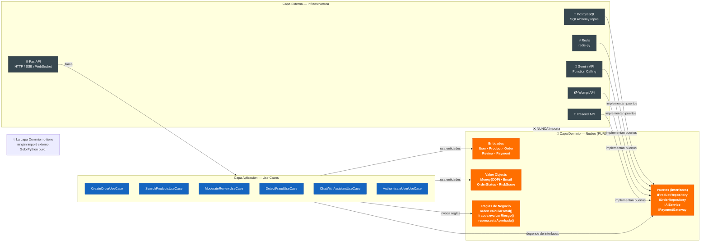
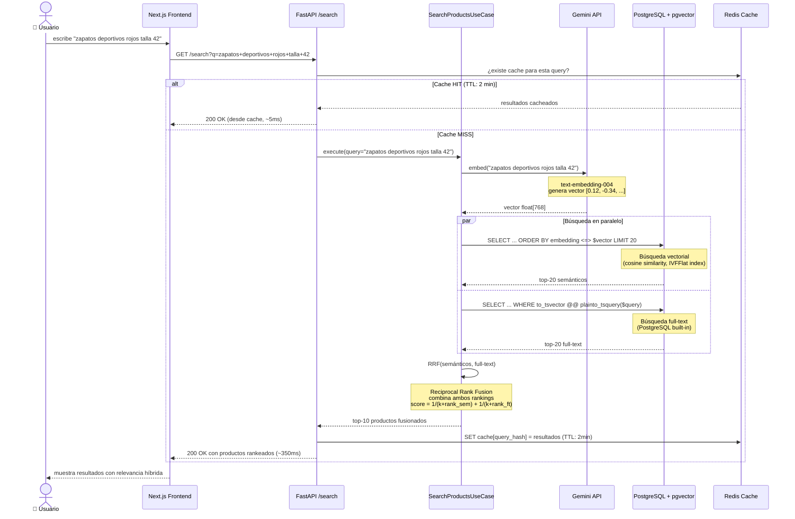
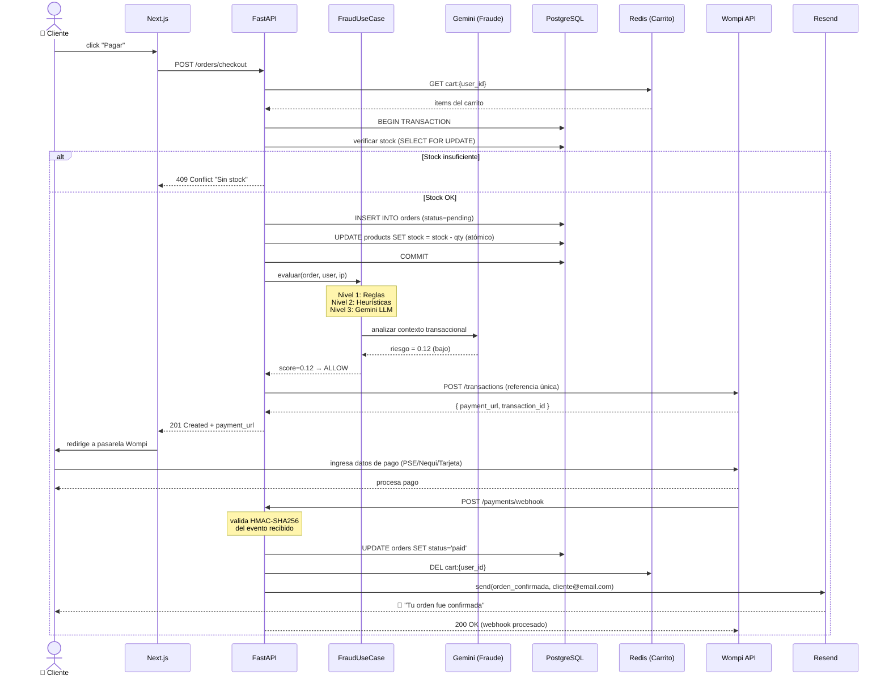
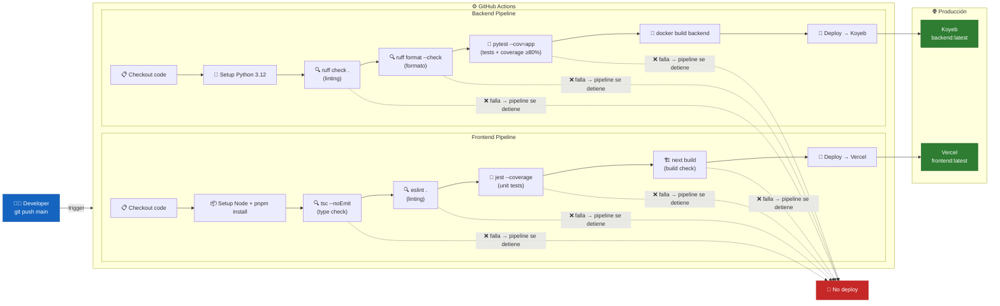

# Arquitectura del Sistema — E-commerce Generalista Colombia

> **Patrón:** Monolito Modular + Clean Architecture + DDD Táctico  
> **Versión:** 1.0 | **Fecha:** 2026-03-13

---

## 1. Diagrama de Sistema (Vista General)

Muestra todos los componentes del sistema y cómo interactúan con los servicios externos.

```mermaid
graph TB
    subgraph USERS["👥 Actores"]
        V["🌐 Visitante<br/>(Browser)"]
        C["🛒 Cliente<br/>(Browser)"]
        A["⚙️ Admin<br/>(Browser)"]
    end

    subgraph FRONTEND["☁️ Vercel — Frontend (Next.js 14)"]
        FE_PUBLIC["📄 Páginas Públicas<br/>Home · Catálogo · Producto · Búsqueda"]
        FE_AUTH["🔐 Páginas Autenticadas<br/>Carrito · Checkout · Órdenes · Perfil"]
        FE_ADMIN["🛠️ Panel Admin<br/>Productos · Órdenes · Reseñas · Fraude"]
        FE_CHAT["💬 Widget Chatbot<br/>(SSE Streaming)"]
    end

    subgraph BACKEND["☁️ Koyeb — Backend (FastAPI + Python 3.12)"]
        direction TB

        subgraph PRESENTATION["presentation/ — FastAPI Routers"]
            R_AUTH["🔑 /auth"]
            R_PROD["📦 /products"]
            R_SRCH["🔍 /search"]
            R_CART["🛒 /cart"]
            R_ORD["📋 /orders"]
            R_PAY["💳 /payments"]
            R_REV["⭐ /reviews"]
            R_CHAT["💬 /chat"]
            R_ADMIN["🛠️ /admin"]
        end

        subgraph APPLICATION["application/ — Use Cases"]
            UC["AuthUseCase · ProductUseCase<br/>OrderUseCase · PaymentUseCase<br/>ReviewUseCase · ChatUseCase<br/>FraudUseCase · SearchUseCase"]
        end

        subgraph DOMAIN["domain/ — Entidades + Reglas de Negocio"]
            ENT["User · Product · Order<br/>Review · Payment · Cart"]
            VO["Money · Email · OrderStatus<br/>RiskScore · Sentiment"]
            REPO_I["IUserRepo · IProductRepo<br/>IOrderRepo · IReviewRepo"]
        end

        subgraph INFRASTRUCTURE["infrastructure/ — Adaptadores"]
            DB_ADAPTER["🐘 SQLAlchemy 2.0 async<br/>(PostgreSQL Repos)"]
            CACHE_ADAPTER["⚡ redis-py async<br/>(Cache + Sesiones)"]
            AI_ADAPTER["🤖 GeminiAdapter<br/>(LLM + Embeddings)"]
            PAY_ADAPTER["💰 WompiAdapter<br/>(Pagos Colombia)"]
            EMAIL_ADAPTER["📧 ResendAdapter<br/>(Emails transaccionales)"]
            STORAGE_ADAPTER["🗂️ SupabaseStorageAdapter<br/>(Imágenes)"]
        end
    end

    subgraph EXTERNAL["🌍 Servicios Externos (Free Tier)"]
        SUPABASE[("🐘 Supabase<br/>PostgreSQL 15 + pgvector<br/>500MB free")]
        REDIS[("⚡ Redis Cloud<br/>30MB free")]
        GEMINI["🤖 Google Gemini<br/>1.5 Flash + text-embedding-004<br/>1,500 req/día free"]
        WOMPI["💳 Wompi<br/>PSE · Nequi · Tarjetas<br/>Sandbox free"]
        RESEND["📧 Resend<br/>100 emails/día free"]
        SENTRY["🚨 Sentry<br/>Error tracking<br/>5K errors/mes free"]
        STORAGE[("🗂️ Supabase Storage<br/>1GB free")]
    end

    subgraph CICD["⚙️ GitHub Actions — CI/CD"]
        PIPELINE["lint → test → docker build → deploy"]
    end

    %% Usuario → Frontend
    V & C & A -->|HTTPS| FE_PUBLIC & FE_AUTH & FE_ADMIN

    %% Frontend → Backend
    FE_PUBLIC & FE_AUTH & FE_ADMIN & FE_CHAT -->|REST API / SSE| PRESENTATION

    %% Capas internas (dependencias hacia adentro)
    PRESENTATION --> APPLICATION
    APPLICATION --> DOMAIN
    APPLICATION --> INFRASTRUCTURE

    %% Infrastructure → Servicios externos
    DB_ADAPTER --> SUPABASE
    CACHE_ADAPTER --> REDIS
    AI_ADAPTER --> GEMINI
    PAY_ADAPTER --> WOMPI
    EMAIL_ADAPTER --> RESEND
    STORAGE_ADAPTER --> STORAGE

    %% Wompi webhook → Backend
    WOMPI -->|"Webhook HMAC-SHA256"| R_PAY

    %% Error tracking
    BACKEND -.->|"errores / excepciones"| SENTRY
    FRONTEND -.->|"errores JS"| SENTRY

    %% CI/CD
    CICD -->|deploy| FRONTEND
    CICD -->|deploy| BACKEND

    %% Estilos
    classDef external fill:#f0f0f0,stroke:#999,color:#333
    classDef frontend fill:#0070f3,stroke:#0050c3,color:#fff
    classDef backend fill:#009688,stroke:#00796b,color:#fff
    classDef domain fill:#ff6f00,stroke:#e65100,color:#fff
    classDef infra fill:#7b1fa2,stroke:#6a1b9a,color:#fff

    class SUPABASE,REDIS,GEMINI,WOMPI,RESEND,SENTRY,STORAGE external
    class FE_PUBLIC,FE_AUTH,FE_ADMIN,FE_CHAT frontend
    class R_AUTH,R_PROD,R_SRCH,R_CART,R_ORD,R_PAY,R_REV,R_CHAT,R_ADMIN backend
    class ENT,VO,REPO_I domain
    class DB_ADAPTER,CACHE_ADAPTER,AI_ADAPTER,PAY_ADAPTER,EMAIL_ADAPTER,STORAGE_ADAPTER infra
```



---

## 2. Arquitectura de Capas (Clean Architecture)

Muestra cómo se organiza el código internamente y la **Regla de Dependencia** (las flechas siempre apuntan hacia adentro).



---

## 3. Flujo de Request — Búsqueda Semántica con IA

Muestra el ciclo de vida completo de una búsqueda desde el browser hasta la respuesta con resultados IA.



---

## 4. Flujo de Orden Completa (Happy Path)

Muestra el flujo crítico: desde que el usuario hace checkout hasta que recibe confirmación de pago.



---

## 5. Pipeline CI/CD

Muestra qué sucede automáticamente cada vez que haces `git push` a `main`.



---

## 6. Estructura de Módulos (Backend)

Cómo se organiza el código en carpetas, siguiendo Clean Architecture.

```
backend/
├── app/
│   ├── domain/                    # ← NÚCLEO PURO (0 imports externos)
│   │   ├── entities/
│   │   │   ├── user.py            # User, UserRole
│   │   │   ├── product.py         # Product, Category
│   │   │   ├── order.py           # Order, OrderItem, OrderStatus
│   │   │   ├── review.py          # Review, Sentiment, ModerationStatus
│   │   │   └── payment.py         # Payment, PaymentStatus
│   │   ├── value_objects/
│   │   │   ├── money.py           # Money(amount, currency="COP")
│   │   │   ├── email.py           # Email (validación en dominio)
│   │   │   └── risk_score.py      # RiskScore(0.0-1.0) + nivel
│   │   └── repositories/          # Interfaces (puertos)
│   │       ├── i_user_repo.py
│   │       ├── i_product_repo.py
│   │       ├── i_order_repo.py
│   │       └── i_ai_service.py    # IAIService (embed, moderate, chat)
│   │
│   ├── application/               # ← CASOS DE USO
│   │   ├── auth/
│   │   │   ├── register_user.py
│   │   │   └── login_user.py
│   │   ├── products/
│   │   │   ├── create_product.py
│   │   │   └── search_products.py # RRF search
│   │   ├── orders/
│   │   │   ├── create_order.py
│   │   │   └── process_payment.py
│   │   ├── reviews/
│   │   │   └── moderate_review.py
│   │   ├── chat/
│   │   │   └── chat_with_assistant.py
│   │   └── fraud/
│   │       └── evaluate_transaction.py
│   │
│   ├── infrastructure/            # ← ADAPTADORES (implementan interfaces)
│   │   ├── database/
│   │   │   ├── models.py          # SQLAlchemy ORM models
│   │   │   ├── repositories/      # Implementaciones concretas
│   │   │   └── migrations/        # Alembic
│   │   ├── cache/
│   │   │   └── redis_client.py    # redis-py async
│   │   ├── ai/
│   │   │   └── gemini_adapter.py  # Gemini Flash + embeddings + Function Calling
│   │   ├── payments/
│   │   │   └── wompi_adapter.py   # Wompi Colombia
│   │   ├── email/
│   │   │   └── resend_adapter.py
│   │   └── storage/
│   │       └── supabase_storage.py
│   │
│   └── presentation/              # ← FASTAPI ROUTERS + SCHEMAS
│       ├── api/
│       │   ├── v1/
│       │   │   ├── auth.py
│       │   │   ├── products.py
│       │   │   ├── search.py
│       │   │   ├── cart.py
│       │   │   ├── orders.py
│       │   │   ├── payments.py    # + webhook endpoint
│       │   │   ├── reviews.py
│       │   │   ├── chat.py        # SSE streaming
│       │   │   └── admin/
│       │   └── router.py
│       └── schemas/               # Pydantic v2 schemas (DTO)
│           ├── auth.py
│           ├── product.py
│           └── order.py
│
├── tests/
│   ├── unit/                      # TDD — domain + application
│   │   ├── domain/
│   │   └── application/
│   └── integration/               # Tests con BD real
│       └── api/
│
├── Dockerfile
├── docker-compose.yml
├── .env.example
└── pyproject.toml                 # ruff + pytest config
```

---

*Siguiente documento: `docs/er-diagram.md` — Entidades y relaciones de la base de datos.*
