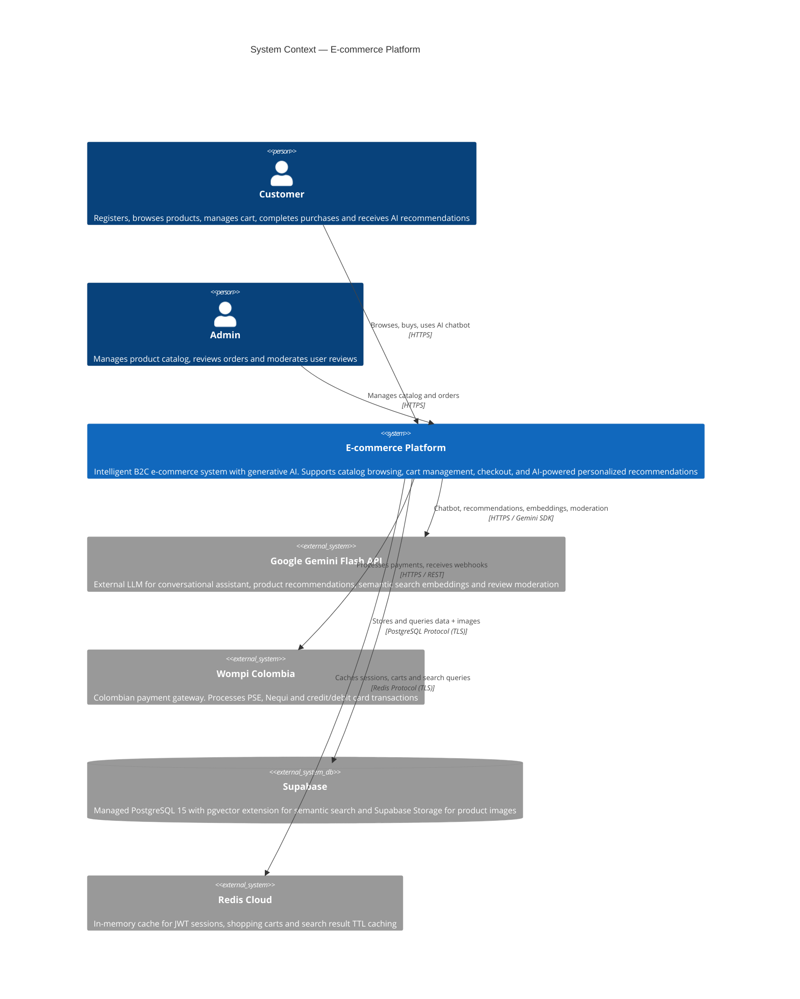
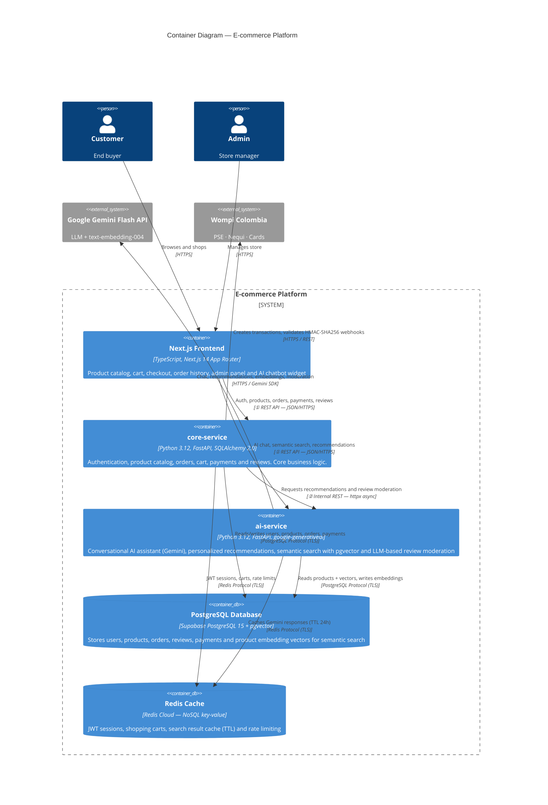

# First Delivery — Architectural Prototype

> **Course:** Software Architecture (Arquisoft)  
> **Delivery:** First Delivery — Vertical Prototype  
> **Date:** 2026-03-18

---

## Team

**Name:** Grupo D

| # | Full Name |
|---|---|
| 1 | Sara Isabel Ospina Valderrama |
| 2 | Juan David Ruiz Guasca |
| 3 | Juan David Castañeda Cárdenas |
| 4 | John Alejandro Pastor Sandoval |
| 5 | Andrés Felipe Perdomo Uruburu |

---

## Software System

**Name:** *(TBD — to be defined by the team)*

**Logo:** *(Placeholder — to be added)*

**Description:**

An intelligent B2C e-commerce platform for the Colombian market that allows users to browse a multi-category product catalog, manage a shopping cart, complete purchases through a Colombian payment gateway, and receive AI-powered personalized recommendations through a conversational assistant.

The system integrates Google Gemini Flash as a generative AI provider to deliver smart product search, personalized recommendations based on browsing and purchase history, and automated review moderation — all without requiring proprietary ML model training.

---

## Functional Requirements

The following functional requirements define the domain and scope of the system as defined by the team:

| ID | Descripción |
|---|---|
| RF-01 | El sistema debe permitir el registro de nuevos usuarios, inicio de sesión y gestión de perfiles individuales. |
| RF-02 | La plataforma debe almacenar el historial de compras y las preferencias del usuario para personalizar la experiencia. |
| RF-03 | El cliente debe poder visualizar el catálogo completo, realizar búsquedas por nombre o categoría y aplicar filtros de productos. |
| RF-04 | La aplicación debe permitir gestionar el carrito de compras y completar el proceso de checkout. |
| RF-05 | El sistema debe sugerir productos similares o complementarios basados en el historial de compras del usuario actual y de usuarios con comportamiento similar, utilizando un modelo de IA generativa. |
| RF-06 | Los usuarios deben poder publicar reseñas y calificaciones sobre los productos adquiridos. |
| RF-07 | El sistema debe exponer un asistente conversacional de IA generativa que ayude al usuario a encontrar productos, resolver dudas y recibir recomendaciones en lenguaje natural. |

### Functional Scope of the Prototype (First Delivery)

The prototype demonstrates a complete **vertical slice** of the system covering the following end-to-end flow:

1. **User authentication** (RF-01) — register and login with JWT
2. **Product catalog** (RF-03) — list products by category, search by name, apply filters
3. **Shopping cart & checkout** (RF-04) — add/remove products, place order (Wompi sandbox)
4. **AI recommendation** (RF-05) — core-service requests personalized recommendations from ai-service via internal REST
5. **AI assistant** (RF-07) — conversational chatbot powered by Google Gemini Flash

This vertical slice covers all architectural layers: `Next.js` → `core-service` → `ai-service` → `PostgreSQL + Redis`.

---

## Non-Functional Requirements

### Team Requirements (Official)

| ID | Descripción | Cómo se satisface |
|---|---|---|
| RNF-01 | **Disponibilidad:** el sistema debe ser resiliente ante fallos de componentes individuales mediante una arquitectura distribuida en contenedores. | `core-service` y `ai-service` son servicios independientes. Un fallo en `ai-service` no interrumpe el flujo de e-commerce del `core-service`. Cada servicio corre en su propio contenedor Docker. |
| RNF-02 | **Separación de responsabilidades:** la lógica de negocio debe distribuirse en microservicios independientes, cada uno con una única responsabilidad de dominio. | `core-service` (auth, productos, órdenes, pagos, reseñas) y `ai-service` (Gemini, recomendaciones, búsqueda semántica, moderación) — dominios completamente separados, desplegables de forma independiente. |
| RNF-03 | **Asistencia IA generativa:** integrar un LLM a través de una API externa para el asistente conversacional y las recomendaciones, sin entrenamiento propio de modelos. | Google Gemini Flash API vía `google-generativeai` SDK. Se consume como API externa. No hay entrenamiento propio ni modelos locales. |
| RNF-04 | **Categorización del catálogo:** los productos deben estar categorizados para facilitar su localización. | Tabla `categories` en PostgreSQL con relación a `products`. El frontend expone filtros y navegación por categoría. |
| RNF-05 | **Despliegue en contenedores:** todos los componentes deben desplegarse localmente mediante Docker Compose con un único comando. | `docker compose up --build` levanta: `frontend`, `core-service`, `ai-service`, `postgres` y `redis`. Un solo comando. |
| RNF-06 | **Multilenguaje:** el sistema debe usar al menos dos lenguajes de programación de propósito general. | Python 3.12 (FastAPI — `core-service` + `ai-service`) y JavaScript/TypeScript (Next.js 14 — `frontend`). |

### Course Requirements (Arquisoft)

| ID | Requirement | How it is satisfied |
|---|---|---|
| C-RNF-01 | Distributed architecture | Three independent deployable units: `frontend` + `core-service` + `ai-service`, all communicating over HTTP |
| C-RNF-02 | At least one presentation component (web front-end) | Next.js 14 App Router — deployed on Vercel |
| C-RNF-03 | At least two logic-type components | `core-service` and `ai-service` — independent Python microservices |
| C-RNF-04 | At least two data-type components (relational + NoSQL) | PostgreSQL 15 + pgvector (relational) and Redis Cloud (NoSQL key-value) |
| C-RNF-05 | At least two different HTTP-based connectors | ① REST JSON/HTTPS — frontend ↔ backend services  ② Internal REST (httpx async) — core-service → ai-service |
| C-RNF-06 | At least two programming languages | Python 3.12 (FastAPI) and TypeScript (Next.js 14) |
| C-RNF-07 | Container-oriented deployment | All components containerized — `docker compose up` deploys the full system locally |

---

## Architectural Structures

### Component-and-Connector (C&C) Structure

#### C&C View — Level 1: System Context



#### C&C View — Level 2: Container Diagram



---

#### Description of Architectural Styles Used

**1. Microservices Architecture**

The backend is split into two independent services with single-responsibility domains:

- **`core-service`** — owns all e-commerce business logic: authentication, product catalog, shopping cart, orders and payments. Deployed on Koyeb (always-ON free tier).
- **`ai-service`** — owns all AI/ML concerns: conversational assistant, product recommendations, semantic search and review moderation. Deployed on Render (free tier). Integrated with Google Gemini Flash.

Both services are independently deployable and fault-tolerant. A failure in `ai-service` does not break the core e-commerce flow.

**2. Clean Architecture (per service)**

Each microservice follows Clean Architecture (Onion Model) with a strict inward dependency direction:

```
Presentation → Application → Domain ← Infrastructure
```

- **Domain layer** — pure Python entities, value objects and repository interfaces. Zero external imports.
- **Application layer** — use cases that orchestrate domain logic.
- **Infrastructure layer** — concrete implementations: SQLAlchemy repositories, Redis cache, Gemini adapter, Wompi adapter.
- **Presentation layer** — FastAPI routers and Pydantic v2 schemas.

**3. BFF Pattern (Backend for Frontend)**

Next.js acts as a Backend-for-Frontend: it calls both `core-service` and `ai-service` from server-side components, aggregating responses before rendering. This avoids exposing internal service URLs to the browser.

---

#### Description of Architectural Elements and Relations

| Element | Type | Technology | Responsibility |
|---|---|---|---|
| `Next.js Frontend` | Presentation component | TypeScript, Next.js 14 | Renders UI; calls core-service and ai-service via REST |
| `core-service` | Logic component | Python 3.12, FastAPI | Auth, products, orders, cart, payments, reviews |
| `ai-service` | Logic component | Python 3.12, FastAPI | Gemini chatbot, recommendations, semantic search, moderation |
| `PostgreSQL + pgvector` | Data component (relational) | Supabase PostgreSQL 15 | Persistent storage of all domain entities + embedding vectors |
| `Redis` | Data component (NoSQL key-value) | Redis Cloud | Session cache, cart state, search TTL cache, rate limiting |
| `REST API connector ①` | HTTP connector | JSON / HTTPS | Communication between frontend and backend services |
| `Internal REST connector ②` | HTTP connector | httpx async / HTTPS | Communication from core-service to ai-service |
| `Google Gemini Flash` | External system | google-generativeai SDK | LLM provider: chat, embeddings, moderation |
| `Wompi Colombia` | External system | REST API | Payment gateway: PSE, Nequi, cards |

---

## Prototype

### Deployment Instructions (Local)

**Prerequisites:**
- Docker Desktop installed and running
- Git

**Steps:**

```bash
# 1. Clone the repository
git clone https://github.com/jpastor1649/ecommerce-project.git
cd ecommerce-project

# 2. Copy environment variables
cp .env.example .env
# Edit .env and fill in:
#   GEMINI_API_KEY=your_key_here
#   WOMPI_PUBLIC_KEY=your_key_here
#   WOMPI_PRIVATE_KEY=your_key_here

# 3. Start all services with a single command
docker compose up --build

# 4. Access the application
# Frontend:              http://localhost:3000
# core-service API docs: http://localhost:8000/docs
# ai-service API docs:   http://localhost:8001/docs
```

**Services started by `docker compose up`:**

| Service | Port | Technology | Description |
|---|---|---|---|
| `frontend` | 3000 | Next.js 14 | Web application |
| `core-service` | 8000 | FastAPI (Python) | Business logic API |
| `ai-service` | 8001 | FastAPI (Python) | AI features API |
| `postgres` | 5432 | PostgreSQL 15 + pgvector | Relational database |
| `redis` | 6379 | Redis | NoSQL cache |

**To stop all services:**
```bash
docker compose down
```

---


