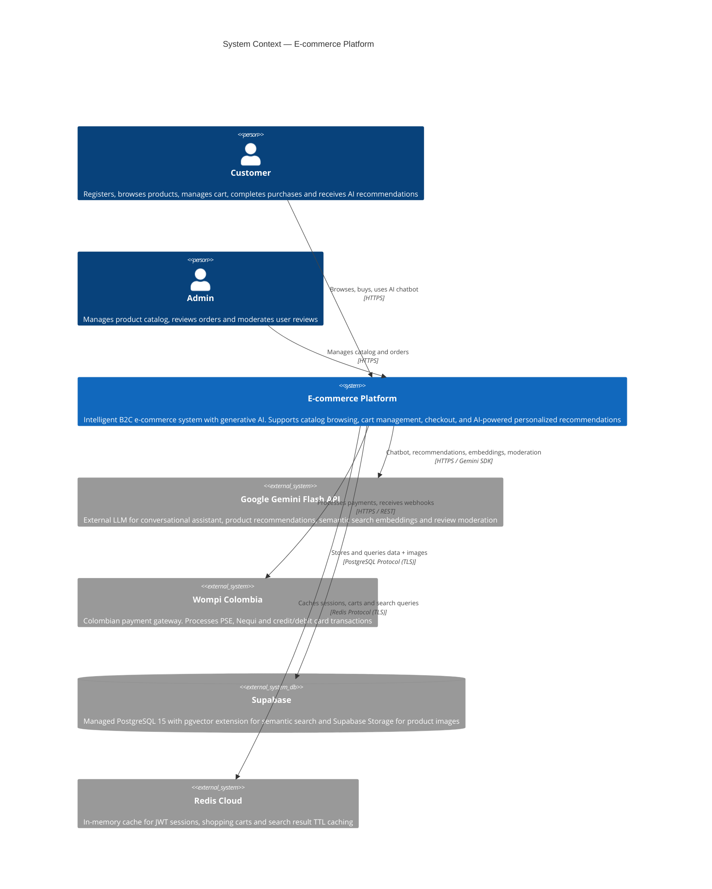
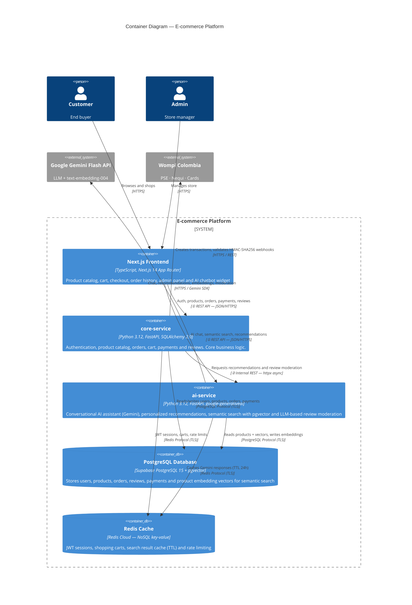

# First Delivery — Architectural Prototype

> **Course:** Software Architecture (Arquisoft)  
> **Delivery:** First Delivery — Vertical Prototype  
> **Date:** 2026-03-18

---

## Team

**Name:** Grupo D

| # | Full Name |
|---|---|
| 1 | Sara Isabel Ospina Valderrama |
| 2 | Juan David Ruiz Guasca |
| 3 | Juan David Castañeda Cárdenas |
| 4 | John Alejandro Pastor Sandoval |
| 5 | Andrés Felipe Perdomo Uruburu |

---

## Software System

**Name:** *(TBD — to be defined by the team)*

**Logo:** *(Placeholder — to be added)*

**Description:**

An intelligent B2C e-commerce platform for the Colombian market that allows users to browse a multi-category product catalog, manage a shopping cart, complete purchases through a Colombian payment gateway, and receive AI-powered personalized recommendations through a conversational assistant.

The system integrates Google Gemini Flash as a generative AI provider to deliver smart product search, personalized recommendations based on browsing and purchase history, and automated review moderation — all without requiring proprietary ML model training.

---

## Functional Requirements

The following functional requirements define the domain and scope of the system:

| ID | Description |
|---|---|
| RF-01 | The system must allow new user registration, login, and individual profile management. |
| RF-02 | Users must be able to browse the full product catalog, search by name or category, and apply filters. |
| RF-03 | Users must be able to manage a shopping cart and complete the checkout process. |
| RF-04 | The system must process payments through Wompi Colombia (PSE, Nequi, credit/debit cards). |
| RF-05 | The system must suggest similar or complementary products based on the user's purchase history using a generative AI model. |
| RF-06 | Users must be able to publish reviews and ratings on purchased products. |
| RF-07 | The system must expose a conversational AI assistant (chatbot) that helps users find products and receive recommendations in natural language. |

### Functional Scope of the Prototype (First Delivery)

The prototype demonstrates a complete **vertical slice** of the system covering the following end-to-end flow:

1. **User authentication** — register and login with JWT
2. **Product catalog** — list products by category, search by name
3. **AI recommendation** — core-service requests personalized recommendations from ai-service via internal REST
4. **Shopping cart** — add/remove products, view cart total
5. **Checkout** — place an order (Wompi sandbox integration)

This scope covers all layers: frontend (Next.js) → core-service (FastAPI) → ai-service (FastAPI) → PostgreSQL + Redis.

---

## Non-Functional Requirements

| ID | Requirement | How it is satisfied |
|---|---|---|
| RNF-01 | Distributed architecture | Two independent backend microservices (`core-service` + `ai-service`) plus a separate frontend (`Next.js`), all communicating over HTTP |
| RNF-02 | At least one presentation component (web front-end) | Next.js 14 (App Router) deployed on Vercel |
| RNF-03 | At least two logic-type components | `core-service` (business logic: auth, products, orders, payments, reviews) and `ai-service` (AI logic: recommendations, search, moderation, chatbot) |
| RNF-04 | At least two data-type components (relational + NoSQL) | PostgreSQL 15 with pgvector (relational) via Supabase + Redis Cloud (NoSQL key-value) for sessions and cart cache |
| RNF-05 | At least two different HTTP-based connectors | ① REST API (JSON/HTTPS) between Next.js frontend and `core-service` ② Internal REST (httpx async) between `core-service` and `ai-service` |
| RNF-06 | At least two programming languages | Python 3.12 (FastAPI — both backend services) and JavaScript/TypeScript (Next.js 14 — frontend) |
| RNF-07 | Container-oriented deployment | All components containerized with Docker; full local deployment with a single `docker compose up` command |

---

## Architectural Structures

### Component-and-Connector (C&C) Structure

#### C&C View — Level 1: System Context



#### C&C View — Level 2: Container Diagram



---

#### Description of Architectural Styles Used

**1. Microservices Architecture**

The backend is split into two independent services with single-responsibility domains:

- **`core-service`** — owns all e-commerce business logic: authentication, product catalog, shopping cart, orders and payments. Deployed on Koyeb (always-ON free tier).
- **`ai-service`** — owns all AI/ML concerns: conversational assistant, product recommendations, semantic search and review moderation. Deployed on Render (free tier). Integrated with Google Gemini Flash.

Both services are independently deployable and fault-tolerant. A failure in `ai-service` does not break the core e-commerce flow.

**2. Clean Architecture (per service)**

Each microservice follows Clean Architecture (Onion Model) with a strict inward dependency direction:

```
Presentation → Application → Domain ← Infrastructure
```

- **Domain layer** — pure Python entities, value objects and repository interfaces. Zero external imports.
- **Application layer** — use cases that orchestrate domain logic.
- **Infrastructure layer** — concrete implementations: SQLAlchemy repositories, Redis cache, Gemini adapter, Wompi adapter.
- **Presentation layer** — FastAPI routers and Pydantic v2 schemas.

**3. BFF Pattern (Backend for Frontend)**

Next.js acts as a Backend-for-Frontend: it calls both `core-service` and `ai-service` from server-side components, aggregating responses before rendering. This avoids exposing internal service URLs to the browser.

---

#### Description of Architectural Elements and Relations

| Element | Type | Technology | Responsibility |
|---|---|---|---|
| `Next.js Frontend` | Presentation component | TypeScript, Next.js 14 | Renders UI; calls core-service and ai-service via REST |
| `core-service` | Logic component | Python 3.12, FastAPI | Auth, products, orders, cart, payments, reviews |
| `ai-service` | Logic component | Python 3.12, FastAPI | Gemini chatbot, recommendations, semantic search, moderation |
| `PostgreSQL + pgvector` | Data component (relational) | Supabase PostgreSQL 15 | Persistent storage of all domain entities + embedding vectors |
| `Redis` | Data component (NoSQL key-value) | Redis Cloud | Session cache, cart state, search TTL cache, rate limiting |
| `REST API connector ①` | HTTP connector | JSON / HTTPS | Communication between frontend and backend services |
| `Internal REST connector ②` | HTTP connector | httpx async / HTTPS | Communication from core-service to ai-service |
| `Google Gemini Flash` | External system | google-generativeai SDK | LLM provider: chat, embeddings, moderation |
| `Wompi Colombia` | External system | REST API | Payment gateway: PSE, Nequi, cards |

---

## Prototype

### Deployment Instructions (Local)

**Prerequisites:**
- Docker Desktop installed and running
- Git

**Steps:**

```bash
# 1. Clone the repository
git clone https://github.com/jpastor1649/ecommerce-project.git
cd ecommerce-project

# 2. Copy environment variables
cp .env.example .env
# Edit .env and fill in:
#   GEMINI_API_KEY=your_key_here
#   WOMPI_PUBLIC_KEY=your_key_here
#   WOMPI_PRIVATE_KEY=your_key_here

# 3. Start all services with a single command
docker compose up --build

# 4. Access the application
# Frontend:              http://localhost:3000
# core-service API docs: http://localhost:8000/docs
# ai-service API docs:   http://localhost:8001/docs
```

**Services started by `docker compose up`:**

| Service | Port | Technology | Description |
|---|---|---|---|
| `frontend` | 3000 | Next.js 14 | Web application |
| `core-service` | 8000 | FastAPI (Python) | Business logic API |
| `ai-service` | 8001 | FastAPI (Python) | AI features API |
| `postgres` | 5432 | PostgreSQL 15 + pgvector | Relational database |
| `redis` | 6379 | Redis | NoSQL cache |

**To stop all services:**
```bash
docker compose down
```

---

*Document generated from Phase 0 discovery — Grupo D, Arquisoft.*
