# Diagrama Entidad-Relación — E-commerce Generalista Colombia

> **Base de datos:** Supabase PostgreSQL 15 + pgvector  
> **ORM:** SQLAlchemy 2.0 async + Alembic  
> **Versión:** 1.0 | **Fecha:** 2026-03-13

---

## 1. Diagrama ER Completo

```mermaid
erDiagram

    %% ─── USUARIOS Y AUTH ───────────────────────────────────────────
    USERS {
        uuid        id              PK
        varchar     email           UK  "único, lowercase"
        varchar     hashed_password     "bcrypt cost=12"
        varchar     full_name
        varchar     phone               "nullable"
        varchar     role                "customer | admin"
        boolean     is_active           "default true"
        boolean     is_verified         "email verificado"
        timestamp   created_at
        timestamp   updated_at
        timestamp   deleted_at          "soft delete, nullable"
    }

    REFRESH_TOKENS {
        uuid        id              PK
        uuid        user_id         FK
        varchar     token_hash          "SHA-256 del token"
        boolean     is_revoked          "default false"
        timestamp   expires_at
        timestamp   created_at
        inet        ip_address          "IP de creación"
    }

    PASSWORD_RESET_TOKENS {
        uuid        id              PK
        uuid        user_id         FK
        varchar     token_hash      UK
        boolean     used                "default false"
        timestamp   expires_at          "TTL: 1 hora"
        timestamp   created_at
    }

    ADDRESSES {
        uuid        id              PK
        uuid        user_id         FK
        varchar     label               "Casa | Trabajo | Otro"
        varchar     street
        varchar     city
        varchar     department          "Cundinamarca, Antioquia..."
        varchar     postal_code         "nullable"
        varchar     country             "default CO"
        boolean     is_default          "default false"
        timestamp   created_at
    }

    %% ─── CATÁLOGO ──────────────────────────────────────────────────
    CATEGORIES {
        uuid        id              PK
        uuid        parent_id       FK  "nullable → categoría raíz"
        varchar     name
        varchar     slug            UK
        text        description         "nullable"
        varchar     image_url           "nullable"
        boolean     is_active           "default true"
        int         sort_order          "para ordenar en UI"
        timestamp   created_at
    }

    PRODUCTS {
        uuid        id              PK
        uuid        category_id     FK
        varchar     name
        varchar     slug            UK
        text        description
        bigint      price_cop           "precio en centavos COP"
        int         stock
        int         stock_alert_threshold "default 5"
        float       rating_avg          "desnormalizado, recalculado"
        int         rating_count        "total de reseñas aprobadas"
        jsonb       attributes          "talla, color, peso, etc."
        boolean     is_active           "default true"
        timestamp   created_at
        timestamp   updated_at
        timestamp   deleted_at          "soft delete"
    }

    PRODUCT_EMBEDDINGS {
        uuid        id              PK
        uuid        product_id      FK  "UK - 1:1 con products"
        vector      embedding           "float[768] — Gemini text-embedding-004"
        text        embedded_text       "texto que se embeddó"
        timestamp   created_at
        timestamp   updated_at
    }

    PRODUCT_IMAGES {
        uuid        id              PK
        uuid        product_id      FK
        varchar     url                 "Supabase Storage URL"
        varchar     storage_path        "path en bucket"
        boolean     is_primary          "imagen principal"
        int         sort_order
        timestamp   created_at
    }

    %% ─── CARRITO ────────────────────────────────────────────────────
    %% El carrito vive en Redis. Esta tabla es solo para auditoría/recuperación.
    CART_SNAPSHOTS {
        uuid        id              PK
        uuid        user_id         FK  "UK - 1 carrito activo por usuario"
        jsonb       items               "snapshot: [{product_id, qty, price_cop}]"
        timestamp   updated_at
    }

    %% ─── ÓRDENES ────────────────────────────────────────────────────
    ORDERS {
        uuid        id              PK
        varchar     order_number    UK  "ORD-2026-000001"
        uuid        user_id         FK
        uuid        address_id      FK  "snapshot en shipping_address también"
        jsonb       shipping_address    "snapshot al momento de la orden"
        bigint      subtotal_cop
        bigint      tax_cop             "IVA 19%"
        bigint      total_cop
        varchar     status              "pending|paid|processing|shipped|delivered|cancelled|refunded"
        varchar     payment_method      "card|pse|nequi"
        timestamp   paid_at             "nullable"
        timestamp   shipped_at          "nullable"
        timestamp   delivered_at        "nullable"
        timestamp   cancelled_at        "nullable"
        text        cancellation_reason "nullable"
        timestamp   created_at
        timestamp   updated_at
    }

    ORDER_ITEMS {
        uuid        id              PK
        uuid        order_id        FK
        uuid        product_id      FK
        varchar     product_name        "snapshot"
        bigint      unit_price_cop      "snapshot del precio al momento"
        int         quantity
        bigint      subtotal_cop        "unit_price * quantity"
        jsonb       product_snapshot    "nombre, imagen, atributos al comprar"
        timestamp   created_at
    }

    %% ─── PAGOS ──────────────────────────────────────────────────────
    PAYMENT_TRANSACTIONS {
        uuid        id              PK
        uuid        order_id        FK
        varchar     wompi_transaction_id UK "id de Wompi"
        varchar     wompi_reference  UK  "referencia única enviada a Wompi"
        bigint      amount_cop
        varchar     currency            "COP"
        varchar     payment_method      "CARD|PSE|NEQUI"
        varchar     status              "pending|approved|declined|voided|error"
        jsonb       wompi_response      "respuesta completa de Wompi"
        varchar     ip_address          "IP del cliente"
        timestamp   created_at
        timestamp   updated_at
    }

    %% ─── RESEÑAS ────────────────────────────────────────────────────
    REVIEWS {
        uuid        id              PK
        uuid        product_id      FK
        uuid        user_id         FK
        uuid        order_id        FK  "valida que compró el producto"
        int         rating              "1-5"
        text        title               "nullable"
        text        body
        varchar     status              "pending|approved|rejected|pending_review"
        varchar     sentiment           "positive|neutral|negative|null"
        float       sentiment_score     "0.0-1.0 confianza del modelo"
        text        moderation_reason   "nullable — por qué fue rechazada"
        jsonb       ai_analysis         "respuesta completa de Gemini"
        int         helpful_count       "cuántos la marcaron útil"
        timestamp   created_at
        timestamp   updated_at
    }

    REVIEW_HELPFUL_VOTES {
        uuid        id              PK
        uuid        review_id       FK
        uuid        user_id         FK
        timestamp   created_at
    }

    %% ─── IA — CHATBOT ───────────────────────────────────────────────
    CHAT_SESSIONS {
        uuid        id              PK
        uuid        user_id         FK  "nullable — usuarios anónimos"
        jsonb       messages            "array de {role, content, timestamp}"
        int         message_count
        timestamp   started_at
        timestamp   last_message_at
    }

    %% ─── IA — FRAUDE ────────────────────────────────────────────────
    FRAUD_EVENTS {
        uuid        id              PK
        uuid        order_id        FK
        uuid        user_id         FK
        float       risk_score          "0.0-1.0"
        varchar     risk_level          "low|medium|high|critical"
        varchar     decision            "allow|review|block"
        jsonb       triggered_rules     "qué reglas dispararon"
        jsonb       ai_analysis         "respuesta de Gemini"
        varchar     reviewed_by         "nullable — admin que revisó"
        varchar     admin_decision      "nullable — approved|rejected"
        timestamp   reviewed_at         "nullable"
        timestamp   created_at
    }

    %% ─── NOTIFICACIONES ─────────────────────────────────────────────
    EMAIL_LOGS {
        uuid        id              PK
        uuid        user_id         FK  "nullable"
        varchar     to_email
        varchar     template_id         "welcome|order_confirmed|order_shipped|etc."
        varchar     resend_id           "nullable — ID de Resend"
        varchar     status              "pending|sent|failed"
        int         attempt_count       "default 0"
        text        error_message       "nullable"
        timestamp   sent_at             "nullable"
        timestamp   created_at
    }

    %% ─── AUDITORÍA IA ───────────────────────────────────────────────
    AI_AUDIT_LOGS {
        uuid        id              PK
        varchar     module              "search|reviews|chat|fraud|recommendations"
        uuid        user_id         FK  "nullable"
        text        prompt_sent
        text        response_received
        varchar     gemini_model
        int         input_tokens
        int         output_tokens
        int         latency_ms
        boolean     fallback_used       "true si Gemini falló y se usó fallback"
        timestamp   created_at
    }

    %% ─── RELACIONES ─────────────────────────────────────────────────

    USERS ||--o{ REFRESH_TOKENS         : "tiene"
    USERS ||--o{ PASSWORD_RESET_TOKENS  : "solicita"
    USERS ||--o{ ADDRESSES              : "tiene"
    USERS ||--o{ ORDERS                 : "realiza"
    USERS ||--o{ REVIEWS                : "escribe"
    USERS ||--o{ REVIEW_HELPFUL_VOTES   : "vota"
    USERS ||--o| CART_SNAPSHOTS         : "tiene 1 activo"
    USERS ||--o{ CHAT_SESSIONS          : "inicia"
    USERS ||--o{ FRAUD_EVENTS           : "es evaluado"
    USERS ||--o{ AI_AUDIT_LOGS          : "genera"
    USERS ||--o{ EMAIL_LOGS             : "recibe"

    CATEGORIES ||--o{ CATEGORIES        : "tiene subcategorías"
    CATEGORIES ||--o{ PRODUCTS          : "contiene"

    PRODUCTS ||--|| PRODUCT_EMBEDDINGS  : "tiene embedding"
    PRODUCTS ||--o{ PRODUCT_IMAGES      : "tiene imágenes"
    PRODUCTS ||--o{ ORDER_ITEMS         : "aparece en"
    PRODUCTS ||--o{ REVIEWS             : "recibe"

    ORDERS ||--o{ ORDER_ITEMS           : "contiene"
    ORDERS ||--o{ PAYMENT_TRANSACTIONS  : "tiene pagos"
    ORDERS ||--o{ FRAUD_EVENTS          : "es evaluada"
    ORDERS ||--o{ REVIEWS               : "habilita reseña"

    ADDRESSES ||--o{ ORDERS             : "usada en"

    REVIEWS ||--o{ REVIEW_HELPFUL_VOTES : "recibe votos"
```



---

## 2. Decisiones de Diseño

### ¿Por qué `price_cop` en centavos (bigint)?
Nunca guardes dinero como `FLOAT` o `DECIMAL` — hay errores de punto flotante. Guardar en centavos como `bigint` es exacto:
- `$1.250.000 COP` → `125000000` (en centavos)
- Sin riesgo de `1250000.0000000001`

### ¿Por qué `jsonb` para `attributes` en productos?
Los productos tienen atributos distintos según categoría:
- Ropa: `{talla: "M", color: "rojo", material: "algodón"}`
- Electrónica: `{ram: "16GB", almacenamiento: "512GB", marca: "Samsung"}`

Con JSONB puedes indexar y filtrar por atributos específicos sin schema rígido.

### ¿Por qué `product_snapshot` en `ORDER_ITEMS`?
Si el admin cambia el nombre o precio de un producto después de que fue comprado, **la orden histórica no debe cambiar**. El snapshot preserva la realidad del momento de compra.

### ¿Por qué `PRODUCT_EMBEDDINGS` en tabla separada?
Los vectores `float[768]` pesan ~3KB cada uno. Separándolos:
1. Las queries de catálogo no cargan los vectores innecesariamente
2. Puedes regenerar embeddings sin tocar la tabla de productos
3. El índice `IVFFlat` de pgvector aplica solo a esa tabla

### ¿Por qué el carrito en Redis y no solo en BD?
| | Redis | PostgreSQL |
|--|-------|-----------|
| Lecturas por sesión | miles/día por usuario | saturarías la BD |
| Modificaciones frecuentes | atómicas, microsegundos | locks, overhead |
| TTL automático | ✅ 7 días nativo | requiere job de limpieza |
| Pérdida si Redis muere | `CART_SNAPSHOTS` como fallback | n/a |

### Índices clave a crear

```sql
-- Búsqueda semántica (pgvector)
CREATE INDEX idx_product_embeddings_vector
ON product_embeddings USING ivfflat (embedding vector_cosine_ops)
WITH (lists = 100);

-- Búsqueda full-text en español
CREATE INDEX idx_products_fts
ON products USING gin(to_tsvector('spanish', name || ' ' || description));

-- Órdenes por usuario (historial)
CREATE INDEX idx_orders_user_id ON orders (user_id, created_at DESC);

-- Reseñas por producto aprobadas
CREATE INDEX idx_reviews_product_approved
ON reviews (product_id, created_at DESC)
WHERE status = 'approved';

-- Tokens de refresco activos
CREATE INDEX idx_refresh_tokens_user_active
ON refresh_tokens (user_id)
WHERE is_revoked = false;
```

---

## 3. Estimación de Tamaño (Free Tier: 500MB)

| Tabla | Filas estimadas (MVP) | Tamaño aprox. |
|-------|----------------------|---------------|
| `products` | 500 | ~2MB |
| `product_embeddings` | 500 | ~1.5MB (768 floats × 4B × 500) |
| `product_images` | 2,500 | ~1MB |
| `categories` | 50 | ~0.1MB |
| `users` | 1,000 | ~0.5MB |
| `orders` | 2,000 | ~2MB |
| `order_items` | 5,000 | ~3MB |
| `payment_transactions` | 2,000 | ~2MB |
| `reviews` | 3,000 | ~5MB |
| `ai_audit_logs` | 10,000 | ~15MB |
| `fraud_events` | 2,000 | ~3MB |
| Índices (todos) | — | ~20MB |
| **TOTAL estimado** | | **~55MB** |

✅ Muy por debajo del límite de 500MB — hay margen para crecer 9x antes de preocuparse.

---

*Siguiente fase: `Fase 1` — Monorepo + Docker Compose + .env.example + GitHub Actions*
